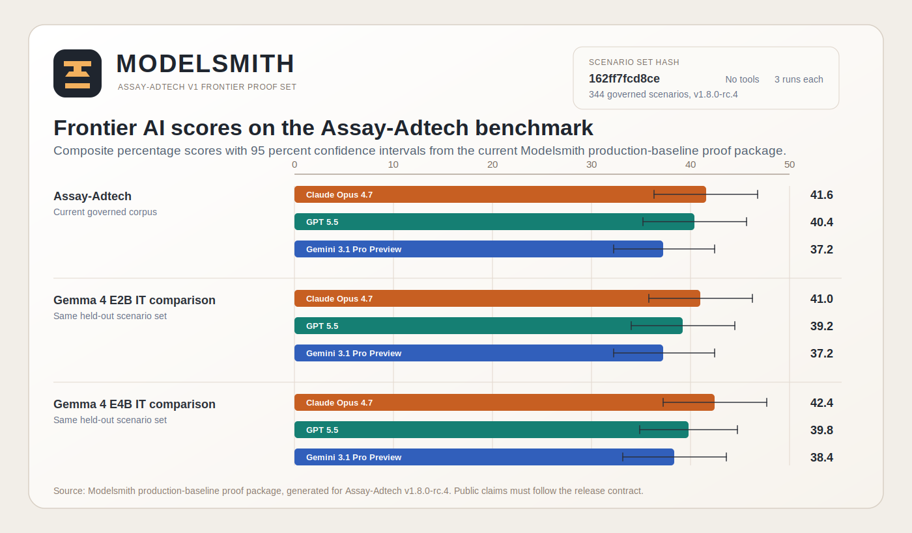

# assay-harness

Open evaluation harness for the [Agentsia Labs](https://agentsia.uk/labs)
benchmark series.

`assay-harness` is the public runner, scoring, and proof package used around
Agentsia Labs benchmark releases. It loads harness-native scenario datasets,
sends prompts to provider or local model runners, evaluates outputs against
published rubrics, writes versioned `RunRecord` JSON, and emits the public
diagnostics and proof metadata needed to keep benchmark claims reproducible.

The scoring mechanism is public and reproducible. The executable scorer enforces the published scoring rules rather than leaving them as prose: it caps keyword-bingo so a response cannot win on vocabulary alone, and it matches negation-aware so "this is **not** invalid traffic" is not credited as if it had flagged invalid traffic. The mechanism is a scoring *rule*, not an answer key. See [Reproducibility](#reproducibility) for the golden self-test that proves a headline number regenerates, and [`docs/public-held-out-boundary.md`](docs/public-held-out-boundary.md) for exactly what is released versus held out.

The first live benchmark is **Assay-Adtech v1**. The governed corpus size, the public/private split, and the scenario-set hash are reported by the release contract, which is the single source of truth for those numbers (see [Assay-Adtech V1 Artifacts](#assay-adtech-v1-artifacts)). The private holdout scenarios are excluded from the public export and exist for leaderboard integrity; they are disclosed as excluded, never silently folded into a public composite.



## Status

**Harness v0.5.1, 2026-06.** The public package now includes first-class
multi-turn execution, schema-v2 scenario-set hash metadata, fail-closed frontier
quorum verification, deterministic proof-bundle manifests, paired-bootstrap
compare intervals, public methodology diagnostics, and scorer conformance
fingerprints. Anthropic, OpenAI, Google Gemini without grounding, Hugging Face
Inference, local vLLM, and deterministic stub runners are implemented. The
public TypeScript types, CLI shape, runner interface, release-contract
validator, and `RunRecord` output format remain stable for the Assay-Adtech v1
release cycle.

**Assay-Adtech artifact bundle v0.4.0.** The GitHub source archive intentionally
contains only the harness source and tiny sample scenarios. The Assay-Adtech v1
public benchmark artifacts remain attached to the original artifact release as
explicit assets:

- [Release contract](https://github.com/agentsia-uk/assay-harness/releases/download/v0.4.0/assay-adtech-v1.8.0-rc.4-release-contract.json)
- [Public harness export](https://github.com/agentsia-uk/assay-harness/releases/download/v0.4.0/assay-adtech-v1.8.0-rc.4-public-harness-export.json)
- [Asset checksums](https://github.com/agentsia-uk/assay-harness/releases/download/v0.4.0/assay-adtech-v1.8.0-rc.4-assets.sha256)

The package release and benchmark artifact release are deliberately separated:
v0.5.0 upgrades the reusable harness surface, while the v0.4.0 artifact bundle
continues to pin the public Assay-Adtech v1 export and release contract.

## Public Surface

- Run single-turn and multi-turn scenario datasets through provider or local
  runners.
- Score with public programmatic rubrics, the anti-bingo mechanism scorer, the
  persistence grader used by multi-turn scenarios, and explicitly configured
  calibrated LLM-judge executors.
- Bind results to scenario-set hashes, including additive schema-v2 metadata
  that covers runner-visible input, axes, rubric descriptors, multi-turn shape,
  and public-safe scorer fingerprints.
- Compare two runs with paired bootstrap intervals on matched scenario/axis
  scores.
- Audit public scenario sets for outcome coverage, lane coverage, duplicates,
  near-duplicates, training-prompt leakage, weak rubrics, item difficulty, and
  release-specific plugin findings.
- Build public proof-bundle manifests that expose checksums, runner metadata,
  claim-gate state, aggregate results, and reproducibility self-test status
  without leaking private prompts, answer keys, raw outputs, or per-scenario
  scores.
- Verify frontier proof metadata fail-closed against a release contract,
  scenario-set hash, hash schema, provider quorum, and optional proof freshness
  policy.

## Get Started

1. Install Node 22 or later and use the pnpm version pinned by Corepack.

   ```bash
   corepack enable
   corepack install
   pnpm install
   ```

2. Confirm the harness CLI can read the bundled sample dataset.

   ```bash
   pnpm assay list examples/scenarios
   ```

   Expected output:

   ```text
   example v0.0.0 (2 scenarios)
     001-echo-hello  [echo]
     002-non-empty  [format]
   ```

3. Run the deterministic sample end to end.

   ```bash
   pnpm assay run \
     --dataset examples/scenarios \
     --runner stub:echo \
     --out runs/local.json
   ```

`runs/local.json` is a `RunRecord` containing the raw model responses, per-scenario scores, aggregate scores, harness version, and command line.

For long provider runs, give the run a stable id and let the harness write an
append-only ledger plus checksum-addressed per-sample traces:

```bash
pnpm assay run \
  --dataset examples/scenarios \
  --runner stub:echo \
  --out runs/local.json \
  --run-id local-smoke-001 \
  --ledger runs/ledgers/local-smoke-001.jsonl \
  --trace-dir runs/traces/local-smoke-001
```

If a run is interrupted, repeat the same command with `--resume`. The CLI
validates the run id, scenario-set hash, runner ids, runner options, aggregate
settings, and trace policy before it skips completed scenario/runner cells.
Failed cells are also appended to the ledger, so a partial run remains
diagnosable. Trace bundles default to public visibility and omit raw outputs;
use `--trace-raw-output redacted` for redacted output text, or
`--trace-visibility internal --trace-raw-output include` only for private
operator storage.

4. Run a real provider model by setting the relevant key and choosing a runner id.

   ```bash
   export ANTHROPIC_API_KEY="..."
   pnpm assay run \
     --dataset examples/scenarios \
     --runner anthropic:claude-opus-4-7 \
     --out runs/claude-sample.json
   ```

   Other runner prefixes are `openai:`, `google:`, `hf:`, and `vllm:`.

5. Download the Assay-Adtech v1 public artifacts.

   ```bash
   mkdir -p artifacts/assay-adtech-v1.8.0-rc.4
   gh release download v0.4.0 \
     --repo agentsia-uk/assay-harness \
     --dir artifacts/assay-adtech-v1.8.0-rc.4 \
     --pattern 'assay-adtech-v1.8.0-rc.4-*'
   ```

6. Verify the release assets.

   ```bash
   cd artifacts/assay-adtech-v1.8.0-rc.4
   shasum -a 256 -c assay-adtech-v1.8.0-rc.4-assets.sha256
   ```

7. Inspect the public benchmark export.

   ```bash
   node -e "const fs=require('fs'); const p='assay-adtech-v1.8.0-rc.4-public-harness-export.json'; const j=JSON.parse(fs.readFileSync(p,'utf8')); console.log(j.metadata); console.log(j.scenarios.length)"
   ```

   The public export should report 113 scenarios for scenario-set hash `162ff7fcd8ce`. The release contract reports the governed corpus size, private-exclusion count, claim gate, and redaction boundary.

## What Is In Scope

This repo provides:

- The `assay` CLI for listing and running harness-native datasets.
- Provider runners for Anthropic, OpenAI, Google Gemini, Hugging Face, local vLLM, and deterministic stubs.
- Core public types for `Scenario`, `Runner`, `ModelResponse`, `Score`, `ModelAggregate`, and `RunRecord`.
- Programmatic rubric scoring, aggregate computation, paired comparison, serialization, proof-bundle generation, methodology diagnostics, frontier proof verification, and strict Modelsmith release-contract validators.
- Multi-turn scenario execution plus the public persistence grader advertised by Modelsmith release contracts.
- Environment-backed scenario execution for stateful tools, observations,
  final-state validators, and redacted proof-ready traces. Domain packs own the
  environment adapters and state; the harness owns the corpus-agnostic bridge.
- Tiny examples that show the dataset shape without embedding benchmark holdout content in the source archive.

This repo does not contain:

- The private scenario-generation pipeline. That lives in Modelsmith.
- The private Assay-Adtech holdout scenarios.
- Agentsia model training code or customer Modelsmith code.
- Scraping, Playwright automation, VPN or proxy rotation, or data-ingestion machinery.

## Assay-Adtech V1 Artifacts

Assay-Adtech v1 release artifacts are governed by Modelsmith and published here as public release assets.

| Artifact | Meaning |
|---|---|
| `assay-adtech-v1.8.0-rc.4-release-contract.json` | Release contract for the governed corpus. Includes corpus counts, scenario-set hash, claim gate, and public redaction contract. |
| `assay-adtech-v1.8.0-rc.4-public-harness-export.json` | Public scenario export. Contains the public scenarios and excludes the private holdout scenarios. |
| `assay-adtech-v1.8.0-rc.4-assets.sha256` | Checksums for the release assets. |

The governed corpus size, the public/private split, the public outcome distribution, the scenario-set hash, and the manifest version are reported **by the release contract**, which is the single source of truth for those numbers. Read them from the contract rather than from this README, so a copy here can never drift from the artifact:

```bash
node -e "const j=require('./assay-adtech-v1.8.0-rc.4-release-contract.json'); console.log({manifest:j.provenance.manifestVersion, hash:j.scenarioSetHash, counts:j.scenarioCounts, split:j.provenance.publicPrivateSplit, claimGate:j.claimGate.status})"
```

A `RunRecord` is bound to the `scenarioSetHash` it was produced against, so a number is always tied to the exact corpus it was measured on and cannot be quoted against a different one. The benchmark claims page and release contract are the public source of truth for Assay-Adtech leaderboard claims. The sample files under `examples/scenarios` are only smoke-test fixtures for the harness package.

New producers should publish schema-v2 hash metadata alongside the bare hash.
Schema v2 binds dataset/domain/plugin identity, runner-visible input, axes,
rubric/scoring descriptors, multi-turn shape, and public-safe implementation or
scorer fingerprints without embedding private answer-key fields. See
[`docs/scenario-set-hash-v2.md`](docs/scenario-set-hash-v2.md).

## Public Proof Bundles

`assay proof build` creates a deterministic public proof manifest for a
`RunRecord` plus release contract:

```bash
pnpm assay proof build \
  --run runs/frontier-run.json \
  --contract artifacts/assay-adtech-release-contract.json \
  --dataset artifacts/public-harness-export.json \
  --out artifacts/assay-proof.json
```

The proof includes checksums, hash schema, scenario-set hash, release-contract
hash, claim-gate status, runner metadata, redacted command line, aggregate
results, and reproducibility self-test status. It does not copy private answer
keys, pass/fail criteria, raw outputs, or per-scenario scores. See
[`docs/proof-bundle-format.md`](docs/proof-bundle-format.md) for the full
format.

`assay frontier verify` checks whether a proof bundle or frontier metadata can
support a public frontier claim. It fails closed when the release contract claim
gate is blocked or malformed, the scenario-set hash or hash schema does not
match, the required provider quorum is unmet, or the proof is stale under the
caller-supplied freshness policy:

```bash
pnpm assay frontier verify artifacts/frontier-proof.json \
  --contract artifacts/assay-adtech-release-contract.json \
  --provider claude --provider gpt --provider gemini \
  --quorum 2 --max-proof-age-days 30
```

## Frontier Baseline Snapshot

The SVG above is a version-labelled Modelsmith Assay-Adtech frontier snapshot,
rendered here as a storefront example of the harness proof surface. It is
benchmark-owned release material, not part of the generic harness API.

| Model | Provider | Composite |
|---|---|---:|
| Fable 5 | Anthropic | 44.2 |
| Opus 4.7 | Anthropic | 41.6 |
| GPT 5.5 | OpenAI | 40.4 |
| Gemini 3.5 Flash | Google | 38.1 |
| Gemini 3.1 Pro Preview | Google | 37.2 |
| Opus 4.8 | Anthropic | 36.0 |
| GPT 5.4 | OpenAI | 36.0 |

Scores are composite percentages against a 100 percent ceiling. Fable 5 is
marked provisional because the source row is a single grandfathered protocol
analysis run. `assay-harness` stays corpus-agnostic: it runs datasets, records
hashes, scores outputs, and verifies proof metadata. Benchmark owners decide
which proof bundles are claim-eligible, so use the benchmark release contract
before quoting a leaderboard or performance claim.

## Concepts

| Term | Meaning |
|---|---|
| **Scenario** | One test case with prompt input, axes, rubric, and metadata. |
| **Runner** | A provider-specific adapter that submits a scenario prompt and returns a `ModelResponse`. |
| **Environment** | Optional stateful tool/action surface attached to a scenario. An environment adapter owns setup, tool transitions, observations, and executable state validators. |
| **Rubric** | The scoring contract for a scenario. The harness supports programmatic, mechanism, calibrated `llm-judge`, and human annotation workflows. |
| **Score** | A normalized 0-to-1 value for one runner on one scenario and one axis. |
| **Axis** | A capability dimension published for a benchmark, such as bid-shading judgement or RTB-payload parsing. |
| **Composite** | Weighted average across axes. Weights are published alongside the benchmark release. |
| **RunRecord** | Top-level output with dataset version, runners, responses, scores, aggregates, and run metadata. |

## Runners

| Runner id | Provider | Environment |
|---|---|---|
| `anthropic:*` | Anthropic Messages API | `ANTHROPIC_API_KEY` |
| `openai:*` | OpenAI Chat Completions API | `OPENAI_API_KEY` |
| `google:*` | Google Gemini API without grounding | `GOOGLE_API_KEY` |
| `hf:*` | Hugging Face Inference endpoint | Optional `HF_TOKEN` |
| `vllm:*` | Local vLLM server, OpenAI-compatible | Optional `VLLM_BASE_URL`, optional `VLLM_API_KEY` |
| `stub:echo` | Deterministic test runner returning the prompt | none |
| `stub:empty` | Deterministic empty-output test runner | none |

Each runner records provider, model, server-reported version where available, temperature, access timestamp, latency, and provider metadata in every `ModelResponse`.

## Rubrics

Programmatic rubrics are implemented in `src/rubric.ts` and can be extended with `registerChecker()`. Built-in checkers:

- `exact-match`
- `contains`
- `non-empty`

The public type surface also defines executable `llm-judge` and `human` lanes. Programmatic rubrics remain the default for benchmark-grade claims. LLM judges require an explicit CLI executor (`--llm-judge-runner` or `--llm-judge-adapter`), calibration evidence, structured JSON output, and judge provenance whose prompt hash matches the calibrated rubric. Benchmark-eligible LLM judges must also include passing bias-check evidence. Judged scores default to `analysis-only`, and publish/proof claim gates fail closed when analysis-only scores are present in claim-allowed material.

Run an `llm-judge` rubric with a provider runner:

```bash
pnpm assay run \
  --dataset path/to/dataset.json \
  --runner openai:gpt-5.5 \
  --llm-judge-runner vllm:Qwen/Qwen3-32B \
  --cache-judges \
  --out runs/judged.json
```

For release-specific judge plumbing, pass a module that exports a default adapter function. The adapter receives the rendered rubric prompt and returns `{ "text": "...", "provider": "...", "model": "..." }`, where `text` must contain JSON with `score` in `0..1` and an optional `rationale`.

```bash
pnpm assay run \
  --dataset path/to/dataset.json \
  --runner stub:echo \
  --llm-judge-adapter ./judge-adapter.mjs \
  --judge-cache-dir .cache/judge \
  --cache-judges \
  --out runs/judged.json
```

Human annotation files can be imported as a JSON array or `{ "annotations": [...] }`. Validation checks required fields, conflicts, and adjudication status; export only uses agreed or adjudicated terminal labels.

```bash
pnpm assay human validate annotations.json
pnpm assay human adjudicate annotations.json --decisions decisions.json --out annotations.adjudicated.json
pnpm assay human export-pairs annotations.adjudicated.json --out preference-pairs.json
```

### Mechanism Scorer And Anti-Bingo

The built-in `contains` checker is a plain substring match. On its own a substring match credits keyword-bingo: a true-positive item keyed on `["invalid traffic", "flag"]` would score a full mark for "this is **not** invalid traffic, do **not** flag", which is the opposite of the right answer. So `contains` is capped at the anti-bingo ceiling unless the rubric explicitly marks `smokeTestOnly: true`; it is for smoke-test fixtures, not benchmark-grade scoring. Benchmark-grade scoring uses the executable mechanism scorer, which caps the credit a response can earn from vocabulary alone and matches negation-aware (a phrase inside a locally-negated clause does not count). The persistence grader described below reuses that same negation-aware matcher. The scorer is bound to a scorer version so a score is reproducible against a known scoring rule. Exposing this rule is deliberate; it is a scoring mechanism, not an answer key, and the per-held-out-scenario phrase expansions stay private (see [`docs/public-held-out-boundary.md`](docs/public-held-out-boundary.md)).

### Multi-Turn And Persistence

Some scenarios are multi-turn: they submit a sequence of adversarial user turns and check whether the model holds its position across them rather than caving to pressure. The release contract advertises these via `multiTurn` / `conversationHistory` and a `persistence-grader-v1` harness dependency. The harness ships that grader (`runMultiTurn` plus `gradePersistence` / `scorePersistence` in `src/persistence-grader.ts`): it walks the conversation, accumulating history per turn, then grades persistence (did the model carry a fact, disposition, constraint, or mechanism forward; did it correctly update on legitimate new evidence). The matcher is the same negation-aware one the mechanism scorer uses, so "I will **not** approve the refund" is not scored as a flip. A scenario marked multi-turn is refused on the single-shot path rather than silently flattened to its first turn.

### Stateful Environments

Environment-backed scenarios add an explicit `environment` block to the normal
scenario shape. The harness remains corpus-agnostic: it validates the public
shape, calls a registered `EnvironmentAdapter`, records model-originated
tool/action calls and observations, runs executable final-state validators, and
collapses the result into normal `ModelResponse` and `Score` entries. Domain
packs own concrete tools, state schemas, setup payloads, action parsers, and
validator implementations.

```json
{
  "id": "counter-reaches-five",
  "axes": ["stateful-tools"],
  "input": {
    "messages": [
      { "role": "user", "content": "Use counter.add until the counter reaches five." }
    ]
  },
  "rubric": { "kind": "programmatic", "checker": "non-empty" },
  "environment": {
    "environmentId": "fixture:counter",
    "setup": { "initial": 0 },
    "maxSteps": 2,
    "toolPolicy": {
      "allowedToolNames": ["counter.add"],
      "maxCalls": 2
    },
    "validators": [
      { "id": "count-equals", "params": { "expected": 5 } }
    ]
  }
}
```

Use `runEnvironmentScenario()` with an adapter, then
`environmentResultToModelResponse()` and `scoreEnvironmentResult()` to fit the
execution into the same `RunRecord` artifact model as normal chat scenarios.
The trace schema (`assay.environment-trace.v1`) includes setup, policy, steps,
actions, observations, final state, validator results, and redaction metadata.
Default redaction masks secret-like keys and token-shaped values; adapters can
provide a stricter redactor for domain-specific state.

## Statistical Claim Gates

`aggregate()` can attach deterministic bootstrap confidence intervals to
per-axis aggregates when callers provide a confidence configuration. The
`assay compare` CLI and `comparePairedScores()` report paired bootstrap
intervals for model A versus model B on the same scenario set. Use paired
intervals when deciding whether a candidate model has genuinely improved over a
baseline. Small deltas without interval support should be treated as
descriptive, not as a promotion claim.

Aggregates also carry additive reliability and operational summaries when run
metadata is available: pass@k, pass^k, sample counts, latency, token/cost
totals, refusal rate, and arbitrary `scenario.meta.slices` breakdowns. Missing
slice labels are grouped under `__unsliced__` so callers can distinguish absent
metadata from a real slice. `assay compare` includes reliability deltas and
slice composite deltas when both RunRecords contain those aggregate fields.

Leaderboard-eligible publication can also enforce a machine-readable claim
card. A claim card binds the quoted run to the dataset identity, hash schema,
claim state, proof freshness, and optional provider quorum cells. The generic
harness only validates that card; benchmark-specific claim text and release
facts remain owned by the benchmark producer.

```bash
pnpm assay compare runs/baseline.json runs/candidate.json
pnpm assay compare runs/baseline.json runs/candidate.json --json
pnpm assay publish runs/candidate.json \
  --dataset examples/scenarios \
  --leaderboard-eligible \
  --claim-card artifacts/claim-card.json
```

New producers that need schema-v2 identity can opt in at run or contract time:

```bash
pnpm assay run \
  --dataset examples/scenarios \
  --runner stub:echo \
  --hash-schema-version v2 \
  --domain example \
  --plugin-id assay.examples \
  --scorer-fingerprint programmatic@1

pnpm assay contract examples/scenarios \
  --hash-schema-version v2 \
  --domain example \
  --plugin-id assay.examples \
  --json
```

## Scenario Diagnostics

`analyseScenarioItems()` reports item-level pass rates, outcome-type coverage, and possible leakage when scenario prompts overlap known training prompts. `compareScenarioSets()` reports added, removed, changed, and suspiciously overlapping scenarios between dataset versions. These diagnostics are intended to help Modelsmith decide whether to generate new training scenarios, revise weak eval items, or block contaminated training data.

`auditScenarioSet()` is the broader public methodology audit. It is domain-generic: the core reads public scenario metadata such as `meta.outcomeType` and lane metadata, while release-specific checks can be supplied as `ScenarioDiagnosticsPlugin` instances. The built-in `createMetadataFreshnessPlugin()` is a generic plugin helper for metadata such as `meta.domainFacts`; adtech-specific stale-fact policy still belongs outside the core package. The audit also checks ambiguous prompts, unverifiable expected outcomes, conflicting rubric gates, stale public facts in `meta.publicFacts`, and release-doc drift when callers provide markdown plus machine-readable release artifacts.

Adversarial diagnostics are plugin-driven. A plugin can implement `generateAdversarialProbes(context)` to return corpus-agnostic perturbation probes, and the public `createGenericAdversarialMutationPlugin()` helper generates generic instruction-override, distractor, and format-pressure probes without embedding benchmark-specific content.

The CLI exposes the same report in readable and JSON forms:

```bash
pnpm assay diagnostics examples/scenarios
pnpm assay diagnostics path/to/public-export.json --json
pnpm assay diagnostics path/to/public-export.json \
  --training-prompts path/to/training-prompts.txt \
  --required-outcome tp --required-outcome tn \
  --required-outcome fp-guard --required-outcome fn-guard \
  --required-lane bid-floor --required-lane pmp \
  --release-doc README.md \
  --release-artifact artifacts/release-contract.json \
  --generic-adversarial-probes \
  --claim-block-doc-drift \
  --claim-block-rubric-ambiguity \
  --fail-on-claim-blocking
```

Diagnostics are labelled by claim impact:

| Diagnostic | Default impact | Why |
|---|---|---|
| Missing `meta.outcomeType` or missing caller-required outcome type | Claim-blocking | Public benchmark claims require explicit outcome stratification. |
| Missing caller-required lane | Claim-blocking | A required methodology lane is absent from the published scenario set. |
| Missing lane metadata with no caller-required lane policy | Advisory | It weakens auditability but may be acceptable for tiny examples. |
| Identical duplicate prompts | Claim-blocking | Duplicate items can distort scenario counts and composite claims. |
| Near-duplicate prompts | Advisory | Similar prompts need review, but a domain owner may intentionally vary a prompt family. |
| Leakage against supplied training prompts | Claim-blocking | Contaminated scenarios should not support public claims. |
| `non-empty` or smoke-only/sign-blind `contains` rubrics | Claim-blocking | Smoke checkers exercise harness plumbing rather than benchmark-grade scoring. |
| Ambiguous prompts or ambiguous rubrics | Advisory by default; rubric ambiguity can be promoted with `--claim-block-rubric-ambiguity` | Domain packs may tolerate tiny smoke fixtures, but release claims should use prompts and rubrics with clear gates. |
| Missing/verifiably empty expected outcomes or conflicting rubric gates | Claim-blocking | A benchmark item cannot support a public claim when the expected outcome is absent or internally contradictory. |
| Stale `meta.publicFacts` entries | Advisory by default | Public fact freshness policy is release-specific; callers can supply stricter plugin findings when needed. |
| Release docs that quote stale counts, hashes, quorum, or claim state | Advisory by default; claim-blocking with `--claim-block-doc-drift` | README prose and artifacts must not diverge from machine-readable release contracts. |
| Generated adversarial mutation probes | Advisory | Probe generation is evidence for hardening workflows; scoring or corpus-specific mutation policy belongs in plugins/domain packs. |
| Too-easy / too-hard scored items | Advisory | They guide item revision but do not prove the scenario is invalid. |
| Plugin findings such as stale domain facts | Plugin-defined | Domain freshness windows are release policy, so plugins choose advisory or claim-blocking severity. |

## Interoperability

`exportInspectRunRecord()` and `exportLmEvaluationSummary()` convert native Assay records into external-eval-friendly shapes for Inspect and lm-evaluation-harness style workflows. `exportPortableRunRecord()`, `exportResultJsonl()`, `exportJUnitXml()`, `exportGitHubActionsAnnotations()`, and `exportExperimentStoreRecords()` add richer CI and experiment-store exports with schema versions, public-safe samples, scores, aggregate metrics, span-style task records, trace/proof references, and explicit lossiness notes.

```bash
pnpm assay export runs/latest.json \
  --dataset artifacts/public-harness-export.json \
  --format portable \
  --out artifacts/assay-portable-run.json

pnpm assay export runs/latest.json --format jsonl --out artifacts/assay-results.jsonl
pnpm assay export runs/latest.json --format junit --pass-threshold 0.8 --out artifacts/junit.xml
pnpm assay export runs/latest.json --format github-annotations --pass-threshold 0.8
pnpm assay export runs/latest.json --format experiment-store --out artifacts/experiment-store.json
```

Native Assay records remain the source of truth because they preserve scenario hashes, privacy classification, scorer metadata, and Modelsmith release boundaries. Interoperability exports are deliberately lossy: private or held-out prompts and derived outputs are omitted, `target` is always `null`, rubric answer-key fields and score rationales are not copied, and raw trace/proof payloads are represented only by public-safe references when present in `RunRecord.meta`.

## Development

```bash
pnpm install
pnpm contracts:cross-repo
pnpm typecheck
pnpm test
pnpm build
pnpm audit:deadcode
```

CI runs the cross-repo contract check, typecheck, tests, build, and dead-code audit for every PR on Node 22 with the pinned pnpm version.

### Dead-Code And Dependency Audit

`assay-harness` is intentionally small, public, and package-oriented. Every exported runner, dependency, and type becomes part of the public maintenance surface. `pnpm audit:deadcode` runs [`knip`](https://knip.dev) as a static-analysis pass with no provider API keys and no network. It reports:

- source files not reachable from `src/index.ts`, the CLI, scripts, or tests
- exported symbols that are not part of the intentional public API
- runtime dependencies with no live implementation
- unused devDependencies.

When you add a provider runner:

1. Export its factory from `src/runners/index.ts` and re-export it from `src/index.ts`.
2. Wire the provider into `resolveRunner()` so the CLI can dispatch to it.
3. Add the provider SDK to `dependencies` only if a runner imports it at runtime.
4. Keep new dependencies justified for a public Apache-2.0 package.

## Reproducibility

Every published Assay release should identify:

- the scenario-set hash and release contract
- the harness version
- the model ids, access timestamps, and run settings
- raw or redacted run records where publication policy allows
- aggregate scores and confidence intervals
- claim-gate status

Provider runners store a common runtime block at `ModelResponse.meta.extra.runtime`
with the provider route, requested and provider-reported model identity, timeout,
SDK package details where available, forwarded generation options, token usage
where returned by the provider, and the active tool/grounding policy. Programmatic
callers may pass generation-only `RunnerOptions.extra` keys: `maxTokens`, `topP`,
and `stopSequences`. Tool, function, grounding, web-search, response-format, and
unknown extra options fail before a provider request is started.

What makes the headline reproducible rather than merely asserted is the **golden reproducibility self-test**: a pinned corpus plus pinned model outputs are scored in CI, and the regenerated composite must equal the published value. Because the scoring mechanism is public (the anti-bingo cap and negation-aware matcher, the persistence grader), anyone can run the same pinned inputs through the same scorer and land on the same number. A score that cannot be regenerated from pinned inputs and the public scorer is not a reproducible score, and should not be quoted as one.

Released versus held-out is drawn explicitly in [`docs/public-held-out-boundary.md`](docs/public-held-out-boundary.md). Released scenarios are reproducibly scorable from this repo. Held-out scenarios are disclosed as held out and never silently mixed into a public composite. Judge-mediated components are disclosed as judge-mediated and default to `analysis-only`.

If a published public artifact cannot be verified against its checksum, file an issue.

## Contributing

Issues and pull requests are welcome. For substantive changes such as a new runner, new rubric type, scoring-logic change, or release-contract field change, open an issue first so the producer and consumer contracts stay aligned.

## Licensing

Apache 2.0. See `LICENSE`.

## Citation

If you cite Agentsia Labs numbers, cite the specific benchmark release and scenario-set hash. The repo is the tool. The benchmark release is the claim.

## Related

- [Assay-Adtech v1 benchmark page](https://agentsia.uk/labs/benchmarks/assay-adtech-v1)
- [Agentsia Labs](https://agentsia.uk/labs)
- [Agentsia](https://agentsia.uk)
